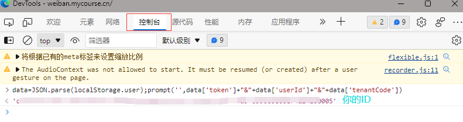

# 安全微伴助手

## 项目源地址
》》》 [安全微课小助手](https://github.com/JefferyHcool/weibanbot) 《《《

本项目基于此项目代码改造，仅支持完成课程，考试等任务不支持。

## 使用方法

启动脚本`main.py`或打包的EXE程序，会自动弹出浏览器，请自行正常登录，然后根据提示按<kbd>F12</kbd>（如果你是笔记本，
F12可能会被改成计算器等软件的快捷启动键，此时你只需要同时按下键盘上的<kbd>FN</kbd>和<kbd>F12</kbd>即可）或在右上角选项中
打开 开发人员工具 ，在选项卡中选中 控制台 （Console），然后在末尾行`>`后复制粘贴以下代码并回车：

`data=JSON.parse(localStorage.user);prompt('',data['token']+"&"+data['userId']+"&"+data['tenantCode'])`

如下图所示：



你的ID会在下方显示的同时还会被弹窗显示，复制这一串ID（不要包含任何引号）到程序中回车即可

如一切顺利，你会看到自己的信息和一个任务列表，任务列表会展示你所有的年度学习任务，并附有序号，类似于下：
```shell
=====学生信息======
姓名：XX
学院：XXXX学院
专业：XXXX专业
任务列表
==================
[1] 2020级新生安全教育(2022-10-31结束)--ID：a1f5b598-13e3-1234-9c9c-0e3a94009fcc
[2] 2021年度安全教育学习(2022-10-31结束)--ID：8eaf2a55-d09c-1234-a677-892d8586e286
[3] 2022年度安全专题学习(2022-10-31结束)--ID：d314d7d2-d1d5-1234-bd2e-7bf285a21ac9
==================
输入你想要完成的课程对应的序号，不要输入任何其它字符，输入数字然后回车即可：
```
输入对应序号即可，如 `3` 然后回车，便会自动开始完成 `2022年度安全专题学习` 

